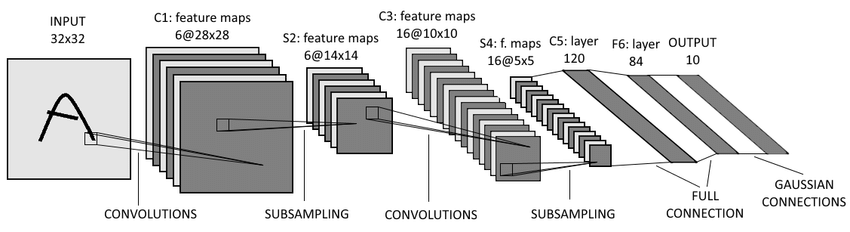
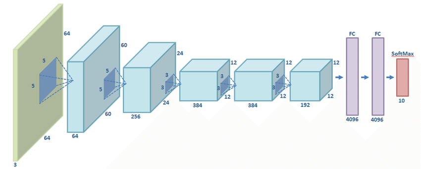
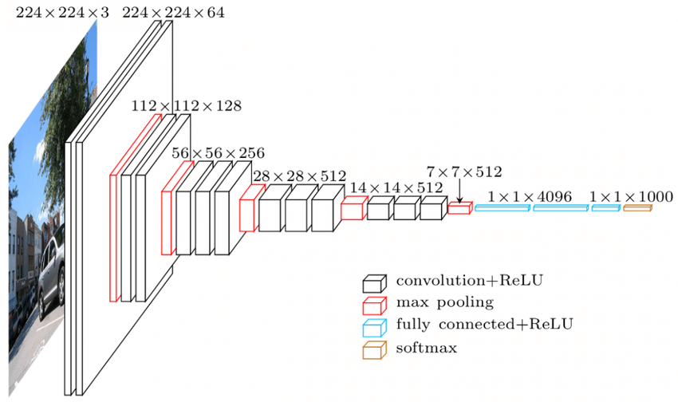

# image-classification
This folder contains the basic image classification networks: [LeNet](https://github.com/Kyrie798/image-classification/tree/main/LeNet), [AlexNet](https://github.com/Kyrie798/image-classification/tree/main/LeNet), [VGG](https://github.com/Kyrie798/image-classification/tree/main/VGG)  
You can download flower classification datasets from [flower](https://storage.googleapis.com/download.tensorflow.org/example_images/flower_photos.tgz) and put it into data
### LeNet
{:height="50%" width="50%"}
### AlexNet
{:height="50%" width="50%"}
### VGG
{:height="50%" width="50%"}
